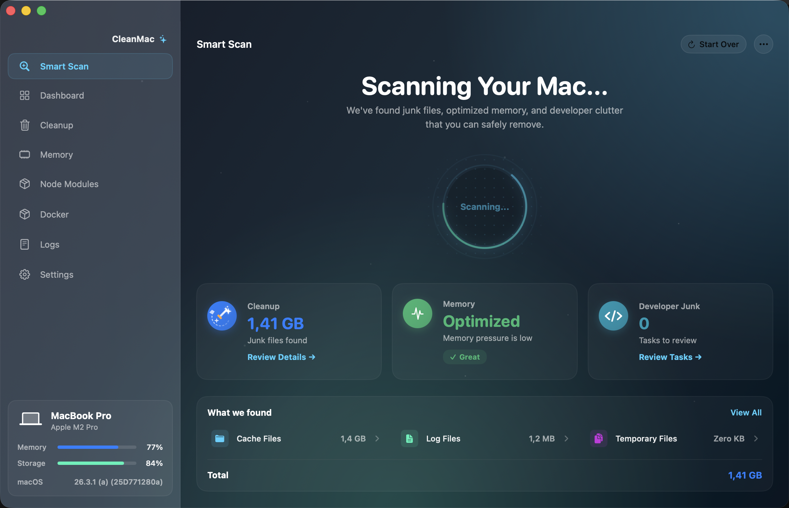

# CleanMac 🧹💻

A native, lightweight, and modern macOS utility designed specifically for developers to monitor system health, optimize memory, and safely clean up bulky workspaces—such as orphaned `node_modules` folders and unused Docker resources.

Built with **SwiftUI** and **AppKit** for high performance, native look-and-feel, and deep system integrations.



---

## Key Features

- **🏠 Current Machine Dashboard**: Real-time diagnostic overview of your Mac, including chip model, memory pressure, disk usage, uptime, system temperatures, and Docker daemon status.
- **🧠 Memory Cleanup**: Dynamic, safe memory diagnostics and optimization to reclaim RAM when your Mac is under heavy load.
- **📦 Node Modules Cleanup**: Deep scans your projects to identify massive `node_modules` folders, categorizing them by size and last modified date for targeted cleanup.
- **🐋 Docker Cleanup**: Safely cleans stopped containers, unused images, dangling volumes, and build cache to reclaim gigabytes of disk space.
- **🛡️ Safety-First Approach**: All scans provide full interactive previews and require explicit confirmation before deleting files. All operations are logged.

---

## Requirements

- **Operating System**: macOS Sonoma (14.0) or higher.
- **Development Tools**: Xcode 15+ or Swift Command Line Tools (Swift 6.0+ recommended).

---

## Getting Started (Development)

Since CleanMac is fully organized as a **Swift Package Manager (SPM)** project, you can easily develop, test, and run it locally without Xcode or by opening the package in Xcode.

### Run via Command Line

To run the application in debug mode:

```bash
swift run
```

### Run Tests

To run the unit test suite:

```bash
swift test
```

---

## Building & Packaging (DMG)

We have automated the process of compiling the binary in release mode, bundling the resources (assets, icons), creating a macOS `.app` bundle, and packaging it into a double-clickable `.dmg` file.

### 1. Build the App and DMG Installer

Run the automated build script:

```bash
./build_dmg.sh
```

This script will:
1. Compile the project in release mode (`swift build -c release`).
2. Create the macOS bundle structure (`build/CleanMac.app`).
3. Embed the application icons and SPM resource bundle.
4. Output a compressed, read-only disk image at `build/CleanMac.dmg`.

### 2. Verify the Package

Once the script completes, open the output folder:

```bash
open build/
```

Double-click `CleanMac.dmg`, and drag **CleanMac** into your **Applications** folder to install it.

---

## Releasing to GitHub

We use **GitHub Actions** to automate our build, test, and release pipeline. 

### Automated Release (Recommended)

To create and publish a new release, simply create a version tag and push it to GitHub. The CI/CD pipeline will automatically run unit tests, compile the application, package it into a compressed `.dmg` file, and create a GitHub Release with the installer attached.

1. **Tag and Push**:
   ```bash
   # Tag the current commit (replace v1.0.0 with your version)
   git tag -a v1.0.0 -m "Release version 1.0.0"

   # Push the tag to your remote origin
   git push origin v1.0.0
   ```

2. **Monitor Action**:
   Navigate to the **Actions** tab in your GitHub repository to track the build and test progress.

3. **Check Releases**:
   Once the workflow run completes, a new release will be automatically published under **Releases** containing the compiled `CleanMac.dmg`.

---

### Manual Release (Alternative/Local)

If you need to build and publish the release manually:

#### 1. Package the DMG
Run the packaging script with custom version variables:
```bash
VERSION="1.0.0" BUILD_NUMBER="1" ./build_dmg.sh
```

#### 2. Publish using GitHub CLI
Create the release and upload the asset using `gh`:
```bash
gh release create v1.0.0 build/CleanMac.dmg \
  --title "CleanMac v1.0.0" \
  --notes "Release version 1.0.0 of CleanMac."
```

Users can now download `CleanMac.dmg` from the GitHub Releases section and run it natively on their Macs!

---

## License

This project is open-source and available under the MIT License.
